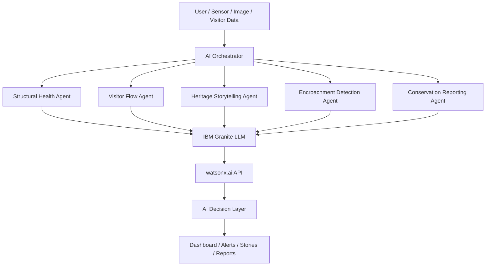

# 🏛 HeritageGuard AI

### Agentic AI Platform for Smart Heritage Conservation & Tourism

> **IBM Granite LLM · IBM watsonx.ai · React · Node.js · Leaflet · Recharts**

---

## 🎯 Problem Statement

Gujarat's iconic heritage sites — **Ahmedabad's UNESCO World Heritage Walled City** and the **Modhera Sun Temple** — face escalating conservation challenges:

- Structural deterioration from weathering, moisture, and vibration
- Unmanaged tourist footfall causing surface abrasion
- Visitor congestion at key monuments
- Potential unauthorized encroachment in buffer zones
- Lack of centralized, AI-driven conservation monitoring
- Underutilized digital storytelling for cultural engagement

---

## ✅ Solution: HeritageGuard AI

A full-stack **Agentic AI platform** where five specialized AI agents collaborate through a central orchestrator to:

1. **Monitor structural health** using simulated IoT sensor data
2. **Manage visitor flow** and recommend crowd control measures
3. **Generate personalized heritage stories** in English, Hindi, and Gujarati
4. **Detect potential encroachment** using AI-assisted image analysis
5. **Produce conservation reports** aggregating all agent data

All AI features are powered by **IBM Granite LLM** through **IBM watsonx.ai**, with a clean fallback to demo mode when credentials are not configured.

---

## 🤖 AI Agents

| Agent | Purpose | Technology |
|-------|---------|-----------|
| **Structural Health Agent** | Analyzes sensor readings, calculates health scores, detects anomalies | IBM Granite + Simulated IoT |
| **Visitor Flow Agent** | Monitors crowd density, recommends management actions | IBM Granite + Simulated Data |
| **Heritage Storytelling Agent** | Generates personalized cultural stories | IBM Granite LLM (RAG) |
| **Encroachment Detection Agent** | Screens images for buffer zone changes | IBM Granite + Simulated CV |
| **Conservation Reporting Agent** | Aggregates all agents, generates priority reports | IBM Granite LLM |
| **AI Orchestrator** | Coordinates all agents, manages events & simulation | Central coordinator |

---

## 🏗 Architecture



---

## 🛠 Technology Stack

### Frontend
- **React 18** + **Vite 5**
- **React Router v6** — client-side routing
- **Recharts** — interactive charts and visualizations
- **React-Leaflet** + **OpenStreetMap** — interactive heritage site map
- **Axios** — API communication

### Backend
- **Node.js** + **Express.js**
- **Multer** — image upload handling
- **Helmet + express-rate-limit** — security
- **Morgan** — request logging

### AI & Cloud
- **IBM Granite LLM** via **IBM watsonx.ai**
- **RAG pattern** — Knowledge base retrieval before Granite prompts
- Clean **Demo Mode** fallback when credentials absent

### Data
- JSON-based data store (easily replaceable with IBM Cloudant/Db2)
- Simulated IoT sensor data
- Simulated visitor data

---

## 📁 Folder Structure

```
HeritageGuard-AI/
├── backend/
│   ├── ai/
│   │   ├── granite/
│   │   │   └── graniteService.js      # IBM Granite LLM integration
│   │   └── knowledge_base/
│   │       ├── heritage_knowledge.json
│   │       └── retrievalService.js    # RAG retrieval layer
│   └── src/
│       ├── agents/
│       │   ├── structural_agent/      # Structural health monitoring
│       │   ├── visitor_agent/         # Visitor flow management
│       │   ├── storytelling_agent/    # Heritage storytelling
│       │   ├── encroachment_agent/    # Encroachment detection
│       │   ├── conservation_agent/    # Conservation reporting
│       │   └── orchestrator/          # Central AI orchestrator
│       ├── data/
│       │   ├── heritage_sites.json
│       │   ├── structural_sensor_data.json
│       │   ├── visitor_data.json
│       │   ├── alerts.json
│       │   ├── conservation_history.json
│       │   └── encroachment_cases.json
│       ├── routes/                    # Express API routes
│       └── server.js
├── frontend/
│   ├── public/
│   │   └── assets/                   # Heritage images (add your own)
│   └── src/
│       ├── components/
│       │   ├── layout/                # Navbar, Sidebar
│       │   ├── map/                   # Leaflet map
│       │   └── ui/                    # ChatWidget, HeritageImage
│       ├── context/                   # AppContext (simulation state)
│       ├── pages/
│       │   ├── visitor/               # Public-facing pages
│       │   └── dashboard/             # Admin/Conservation pages
│       └── services/
│           └── api.js                 # All API calls
└── README.md
```

---

## 🚀 Installation & Running Locally

### Prerequisites
- Node.js v18+ 
- npm v9+

### 1. Clone / Extract the project

```bash
cd HeritageGuard-AI
```

### 2. Install Backend Dependencies

```bash
cd backend
npm install
```

### 3. Configure Environment Variables

```bash
cp .env.example .env
# Edit .env with your IBM credentials (optional — works in Demo Mode without them)
```

### 4. Start Backend

```bash
# In /backend directory:
npm run dev
# Server starts on http://localhost:5000
```

### 5. Install Frontend Dependencies

```bash
cd ../frontend
npm install
```

### 6. Start Frontend

```bash
npm run dev
# Opens at http://localhost:5173
```

---

## 🔑 Environment Variables

Create `backend/.env` (copy from `backend/.env.example`):

```env
# IBM watsonx.ai Credentials (optional — app works without these in Demo Mode)
IBM_CLOUD_API_KEY=your_ibm_cloud_api_key_here
WATSONX_PROJECT_ID=your_watsonx_project_id_here
WATSONX_URL=https://us-south.ml.cloud.ibm.com
GRANITE_MODEL_ID=ibm/granite-13b-instruct-v2

# Server
PORT=5000
NODE_ENV=development
FRONTEND_URL=http://localhost:5173
```

---

## ⚡ IBM Granite LLM Setup

1. Log in to [IBM Cloud](https://cloud.ibm.com)
2. Navigate to **watsonx.ai** and create a new project
3. Note your **Project ID**
4. Generate an **IBM Cloud API Key** (IAM → API Keys)
5. Find your regional **watsonx.ai URL** (e.g., `https://us-south.ml.cloud.ibm.com`)
6. Add all values to `backend/.env`
7. Restart the backend

When IBM Granite is connected, all AI features use real LLM responses. Without credentials, realistic demo responses are returned and clearly labeled as **Demo AI Mode**.

---

## 🎭 Demo Mode

The application works **fully without IBM credentials** or physical sensors:

- All sensor data is **simulated** (labeled "DEMO/SIMULATED DATA")
- All visitor counts are **simulated**
- AI responses fall back to realistic **demo responses**
- Click **"Start Simulation"** in the navbar to see live data updates
- All features remain functional including stories, reports, and agent activity

---

## 📡 API Documentation

| Method | Endpoint | Description |
|--------|----------|-------------|
| GET | `/api/sites` | All heritage sites |
| GET | `/api/sites/:id` | Single site details |
| GET | `/api/structural-health` | All sensor readings |
| POST | `/api/structural-health/analyze` | AI analysis of sensor |
| GET | `/api/visitors` | Visitor flow data |
| POST | `/api/visitors/analyze` | AI visitor recommendations |
| POST | `/api/storytelling/generate` | Generate personalized story |
| GET | `/api/encroachment` | Encroachment cases |
| POST | `/api/encroachment/analyze` | Analyze image for encroachment |
| GET | `/api/alerts` | All alerts |
| POST | `/api/alerts` | Create new alert |
| PATCH | `/api/alerts/:id/status` | Update alert status |
| GET | `/api/conservation/report` | Conservation reports |
| POST | `/api/conservation/report` | Generate new report |
| POST | `/api/ai/chat` | AI chat assistant |
| GET | `/api/agents/status` | All agent statuses |
| POST | `/api/agents/simulation/start` | Start simulation |
| POST | `/api/agents/simulation/stop` | Stop simulation |
| POST | `/api/agents/analyze` | Run full multi-agent analysis |
| GET | `/health` | Server health check |

---

## 🎨 Image Assets

Place heritage images in `frontend/public/assets/`:

```
frontend/public/assets/
├── ahmedabad/
│   ├── walled_city/     # Images of Ahmedabad Walled City
│   ├── pol_houses/      # Traditional pol house images
│   ├── heritage_buildings/
│   └── streets/
├── modhera/
│   ├── sun_temple/      # Sun Temple images
│   ├── stepwell/        # Surya Kund images
│   ├── architecture/
│   └── carvings/
└── ui/
    ├── hero/            # Hero background image (hero.jpg)
    └── cards/
```

The app **automatically detects** available images and uses placeholder icons when images are missing. No filenames are hard-coded.

---

## 🔮 Future Scope

- Real IoT sensor integration via IBM IoT Platform
- Computer vision with IBM Visual Recognition / Watson Vision
- IBM Cloudant / Db2 database integration
- Mobile app for on-site heritage inspectors
- Satellite imagery ingestion for encroachment monitoring
- Multi-language voice narration using IBM Text-to-Speech
- Visitor pre-booking system to manage capacity
- Integration with Archaeological Survey of India APIs

---

## ⚠️ Limitations

- All sensor and visitor data is **simulated** for demonstration
- Encroachment detection uses **simulated computer vision** results
- AI recommendations are **decision support tools**, not official guidance
- No real-time satellite imagery integration in this prototype
- Images must be manually placed in the assets folder

---

## 👥 License

MIT License — Built for demonstration and educational purposes.

**Heritage data sourced from public domain knowledge about Ahmedabad Walled City (UNESCO) and Modhera Sun Temple (ASI).**
